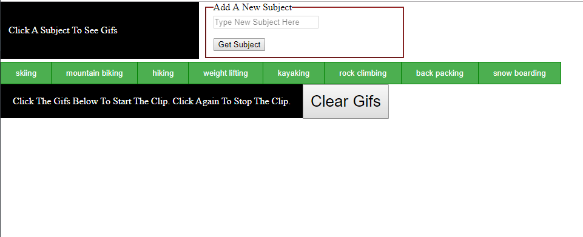
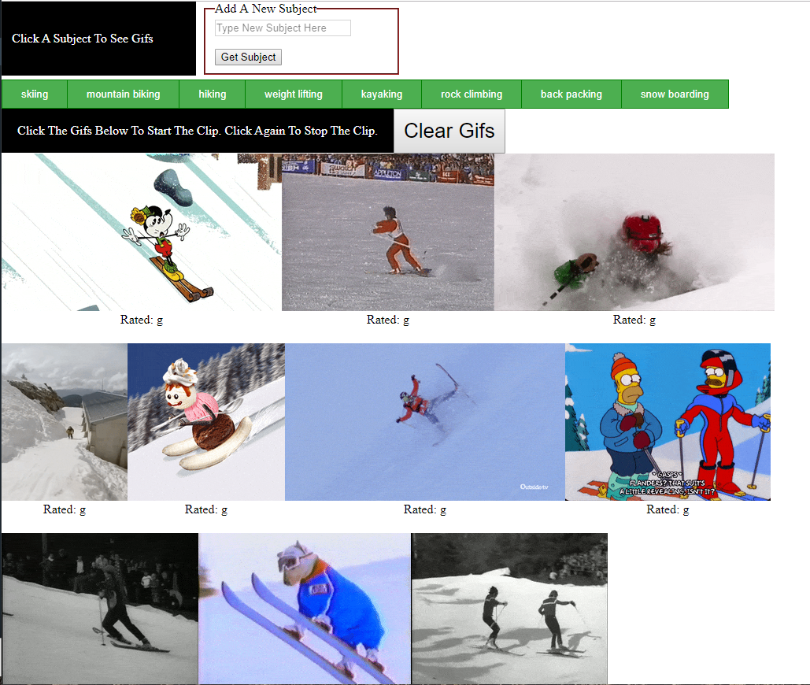

# GifTastic

### Project Overview

This project uses the GIPHY API to make a dynamic web page that populates with gifs. This is accomplished by calling the GIPHY API and using JavaScript and jQuery to dynamically change the HTML.

# Project Requirements:
```
Theme: Outdoors activities (prepoluated with 8 topics).

Functional Highlights:
    - Buttons corresponding to each activity are generated using javascript/jquery.
    - Form that takes a value from a user input box and adds it to the topics array.
    - All buttons are regenerated via a function call each time a new button is added.
    - When the user clicks on a button the page grabs 10 static, non-animated gif images using the GIPHY API and places them on the page.
    - Each gif image is clickable.
    - When the user clicks one of the still GIPHY images the gif animates. When the user clicks the gif again the gif stops playing.
    - Under every gif its rating is displayed (e.g. PG, G, etc).
    - A Clear button allows the user to clear out the currently populated gifs.

Technology Requirements:
    1. Page Layout
        a. HTML
        b. CSS
    2. Logic and DOM manipulation
        a. Javascript
        b. jQuery
    3. GIF Source
        a. API calls made to giphy.com

```
 
 ### Page Link: https://kbrowngithub.github.io/GifTastic/
 
 # Features
 #####
```
 
 Start Screen

 ```
 

 ```
 
 GIF Screen

 ```
 